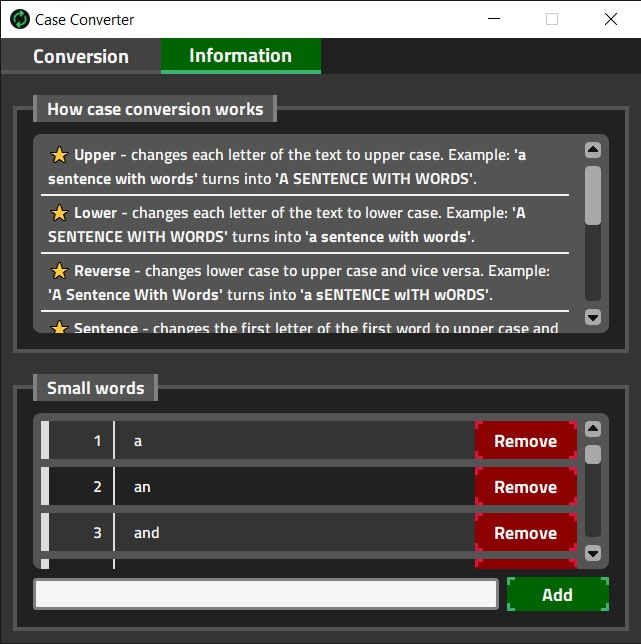

# Case Converter

## Description
A small PyQt application that allows to convert the case of text. 
It supports the following text case transformations:

### Supported Cases
+ Upper
+ Lowers
+ Reverse 
+ Capitalize
+ Sentence
+ Title

## Portable Application
[Download](https://github.com/I-antiva-I/case_converter/archive/refs/heads/build.zip)

## Screenshots

  
  

## Tools
+ PyQt - GUI framework
+ SCSS - Styling
+ MVVM - Design pattern

## License
MIT License (see the LICENSE file for details)
